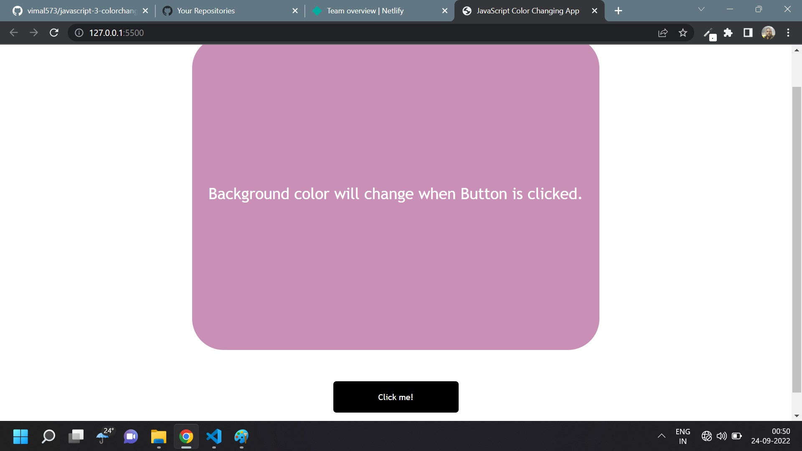

# Javascript Assignment Color changer

## Color Changer [Live Link](https://name-conversion-js.netlify.app/)

- Skills Gained in this project

  - lern addEvent on click

  - use Math.random to get random number

---

## Time taken to finish this project

- 30 minutes to complete it

#### Screenshot

